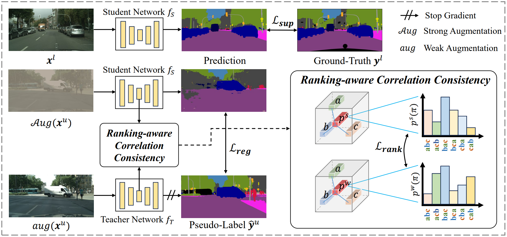

# RankMatch
This is the official PyTorch implementation for our CVPR2024 paper "[RankMatch: Exploring the Better Consistency Regularization for Semi-supervised Semantic Segmentation](https://openaccess.thecvf.com/content/CVPR2024/papers/Mai_RankMatch_Exploring_the_Better_Consistency_Regularization_for_Semi-supervised_Semantic_Segmentation_CVPR_2024_paper.pdf)".

<p align="left">

</p>

## Getting Started

### Installation

```bash
cd RankMatch
conda create -n rankmatch python=3.10.4
conda activate rankmatch
pip install -r requirements.txt
pip install torch==1.12.1+cu113 torchvision==0.13.1+cu113 -f https://download.pytorch.org/whl/torch_stable.html
```

### Pretrained Backbone

[ResNet-50](https://drive.google.com/file/d/1mqUrqFvTQ0k5QEotk4oiOFyP6B9dVZXS/view?usp=sharing) | [ResNet-101](https://drive.google.com/file/d/1Rx0legsMolCWENpfvE2jUScT3ogalMO8/view?usp=sharing) | [Xception-65](https://drive.google.com/open?id=1_j_mE07tiV24xXOJw4XDze0-a0NAhNVi)

```
├── ./pretrained
    ├── resnet50.pth
    ├── resnet101.pth
    └── xception.pth
```

### Dataset

- Pascal: [JPEGImages](http://host.robots.ox.ac.uk/pascal/VOC/voc2012/VOCtrainval_11-May-2012.tar) | [SegmentationClass](https://drive.google.com/file/d/1ikrDlsai5QSf2GiSUR3f8PZUzyTubcuF/view?usp=sharing)
- Cityscapes: [leftImg8bit](https://www.cityscapes-dataset.com/file-handling/?packageID=3) | [gtFine](https://drive.google.com/file/d/1E_27g9tuHm6baBqcA7jct_jqcGA89QPm/view?usp=sharing)
- COCO: [train2017](http://images.cocodataset.org/zips/train2017.zip) | [val2017](http://images.cocodataset.org/zips/val2017.zip) | [masks](https://drive.google.com/file/d/166xLerzEEIbU7Mt1UGut-3-VN41FMUb1/view?usp=sharing)

Please modify your dataset path in configuration files.

**The groundtruth masks were preprocessed by [UniMatch](https://github.com/LiheYoung/UniMatch).**

The final folder structure should look like this:
```
├── RankMatch
	├── pretrained
		└── resnet50.pth, ...
	└── rankmatch.py
	└── ...
├── data
	├── pascal
		├── JPEGImages
		└── SegmentationClass
	├── cityscapes
		├── leftImg8bit
		└── gtFine
	├── coco
		├── train2017
		├── val2017
		└── masks
```

## Usage

### RankMatch

```bash
# use torch.distributed.launch
sh scripts/train.sh <num_gpu> <port>
```


## Citation

If you find this project useful, please consider citing:

```bibtex
@inproceedings{mai2024rankmatch,
  title={RankMatch: Exploring the Better Consistency Regularization for Semi-supervised Semantic Segmentation},
  author={Mai, Huayu and Sun, Rui and Zhang, Tianzhu and Wu, Feng},
  booktitle={Proceedings of the IEEE/CVF Conference on Computer Vision and Pattern Recognition},
  pages={3391--3401},
  year={2024}
}
```

## Acknowledgements
RankMatch is primarily based on [UniMatch](https://github.com/LiheYoung/UniMatch). 
We are grateful to their authors for open-sourcing their code.
